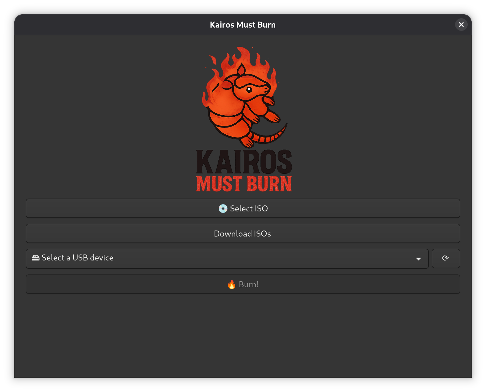
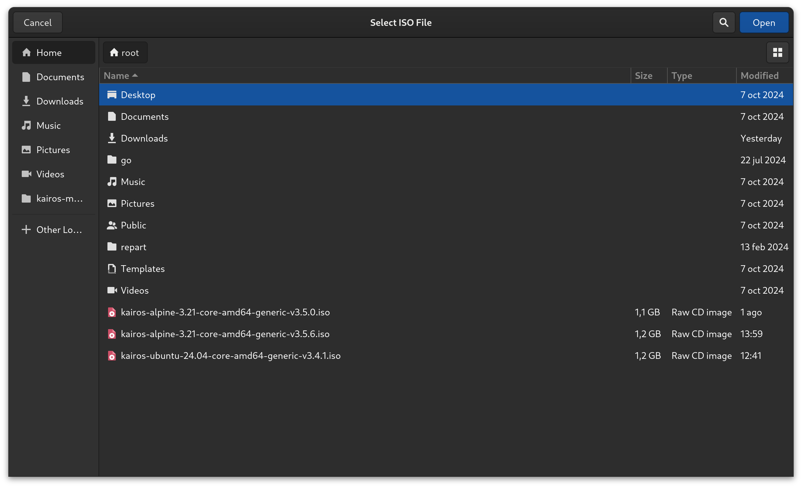
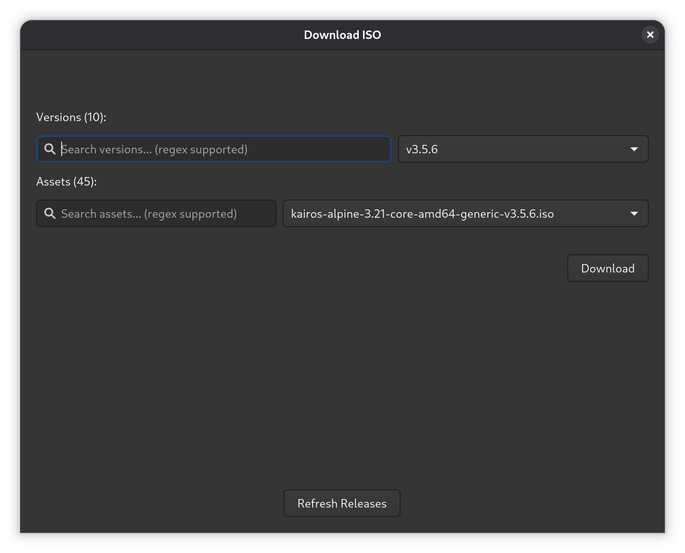
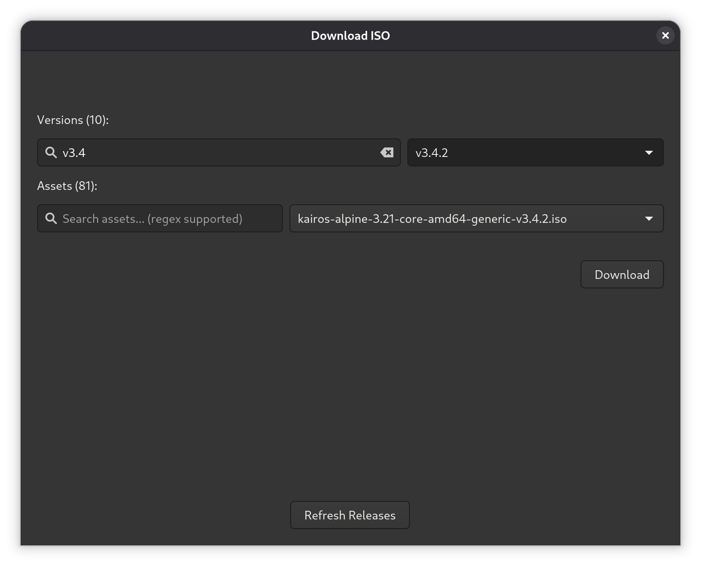
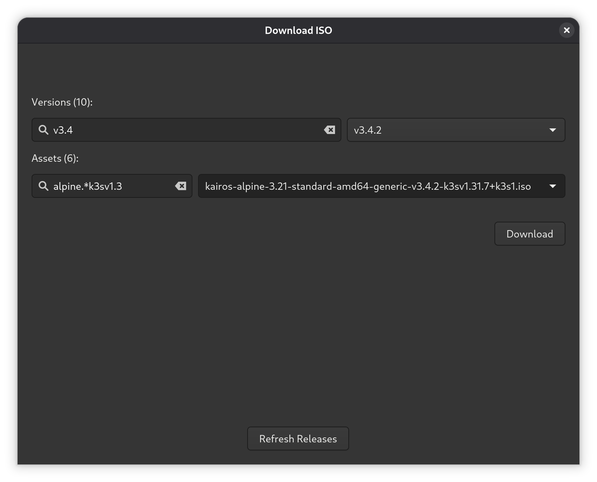
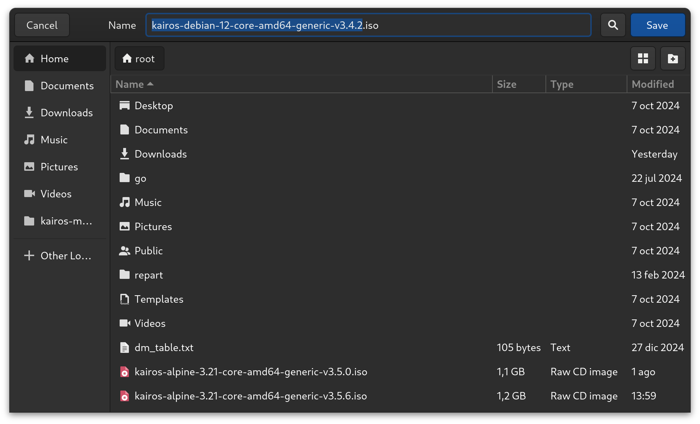
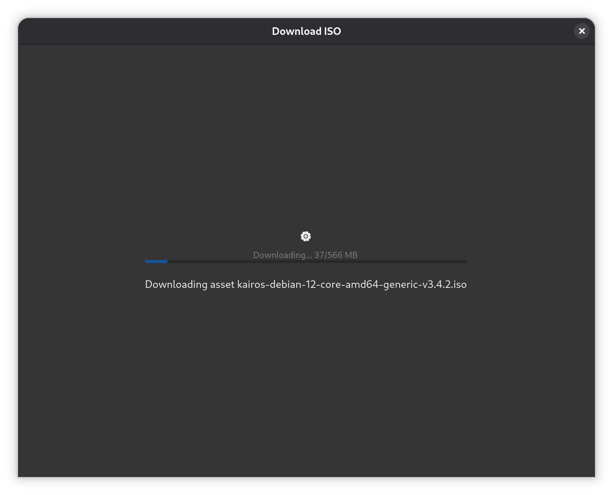
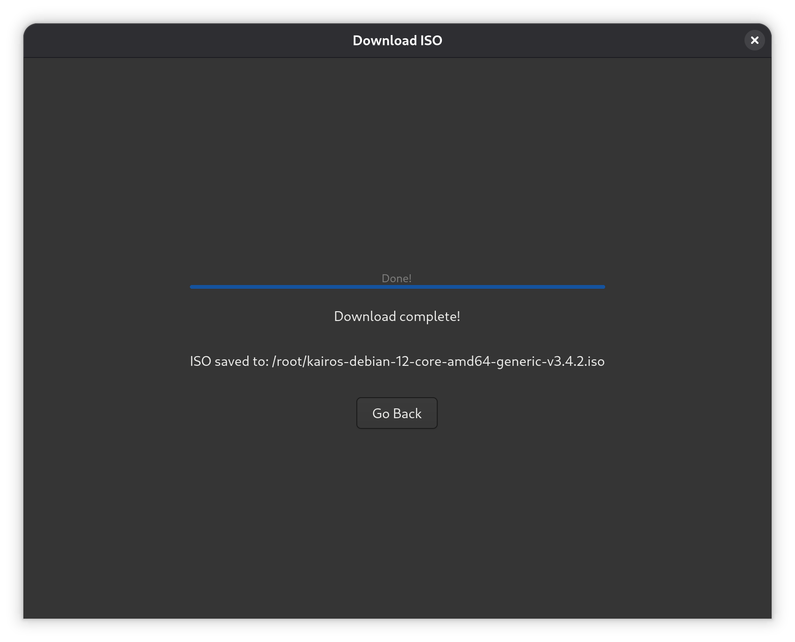
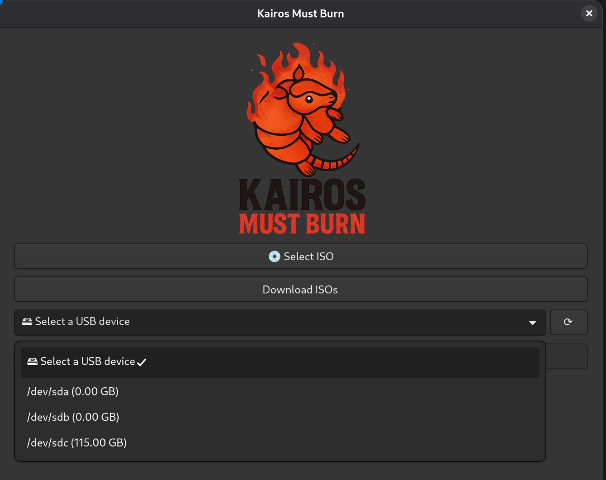
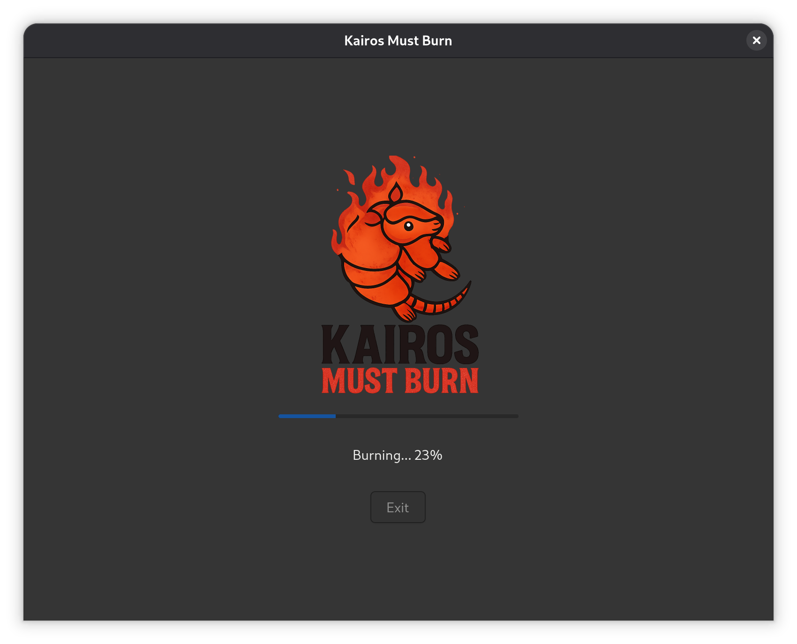

# Kairos Must Burn — Usage

Simple, step-by-step instructions to pick, download (optional), and burn a Kairos ISO to a USB device.

---

## Quick overview
1. **Select an ISO** (from disk) or **Download ISOs** from releases.
2. **Select a USB device** as the target.
3. Click **🔥 Burn!** to write the ISO to the USB.

---

## 1 — Main window
The app’s main window: choose between selecting an ISO from disk, downloading an ISO, pick a USB device, then burn.

---

## 2 — Select an ISO from disk
- Click **Select ISO**.
- Use the file chooser to navigate to and pick an existing `.iso`, then click **Open**.

---

## 3 — Download an ISO from releases (optional)
If you don’t have the ISO locally, download one from the releases:

1. Click **Download ISOs**.
2. Use **Versions** to pick a release (or search with regex).
3. Use **Assets** to pick or search the exact ISO you want. The search boxes accept **regular expressions** for precise filtering.
4. Click **Download**.

You can refine searches (example: `v3.4`, `alpine`, or `alpine.*k3sv1.3`) to narrow results:

  

- The app will prompt where to save the downloaded ISO. Choose a folder and **Save**.

- Download progress and completion are shown with a progress bar and final confirmation:

  

When finished, the UI shows the full path where the ISO was saved.

---

## 4 — Select the USB device
- Use the **Select a USB device** dropdown to pick the target USB stick.
- Click the refresh icon beside the dropdown to rescan attached devices.

---

## 5 — Burn the ISO
- With the ISO and USB device selected, click **🔥 Burn!**.
- The app writes the ISO to the selected device and shows progress until completion.

**Important:** Burning overwrites the target USB device. Double-check you selected the correct device before proceeding.

---

## Tips & notes
- **Regex searches:** The download UI supports regular expressions for filtering versions and assets. Example: `alpine.*k3sv1.3`.
- **Refresh Releases:** Click **Refresh Releases** if you don’t see the release you expect.
- **Permissions:** Writing to raw devices or saving to protected locations (like `/root`) may require elevated privileges.
- **Verify target:** Always double-check the target USB device — the write is destructive.

---

That’s it — select or download an ISO, choose the USB, and burn.
